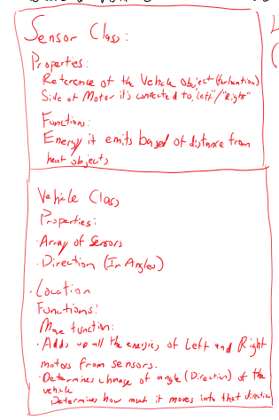
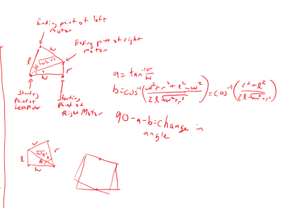

### [Home](index.html)

### [Code](https://balta-z-r.github.io/braitenberg)

# Braitenberg Vehicles:

In this project, I created the basic Braitenberg vehicles using sensors and motors that where connected to each other. The sensor was made to detect heat, which was emitted from the mouse cursor, and would pass on the level of heat it detected to its motor, the higher the heat, the higher the value it would return to its connected motor/s. There were 4 basic vehicles.

- Simple: Composed of two motors and one sensor connected to both motors
- Fear: Composed of two motors and two sensors, left sensor connected to left motor and right sensor connected to right motor
- Aggression: Composed of two motors and two sensors, left sensor connected to right motor and right sensor connected to left motor
- Love: Composed similar to aggression but would slow down as it approached the heat source

## How I approached the project:

I decided to do this project in Javascript, more specifically using the p5.js library since it was a simple way to integrate graphics. I also decided to add an option to create your own vehicle with your own sensors connected to which ever motor you wanted (Left/Right/Both). In this way, I was able to test out new forms of vehicles and create a wide variety of them.

## Reflection on the challenges I faced:

One of the biggest challenges I faced was making the vehicle. Should I have 4 classes for each kind of vehicle (Simple, Fear, Aggression, Love) or only two classes (Vehicle and Sensor) and make the different types of vehicles by changing the parameters within the Vehicle/Sensor class. I opted for the latter, so I planned out what each class would have for its parameters.

This would later help me create my 'Create Mode' function to make your own vehicle since the vehicle didn't have to bound to one specific kind of vehicle.

My second challenge was figuring out how my vehicles would rotate. To solve this, I drew out a sketch of how the vehicle would turn and used my prior knowledge of Geometry to figure out how I would go about rotating the vehicle.

