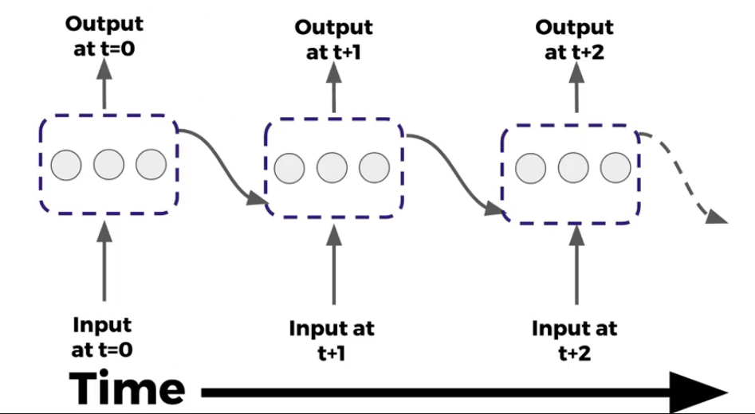
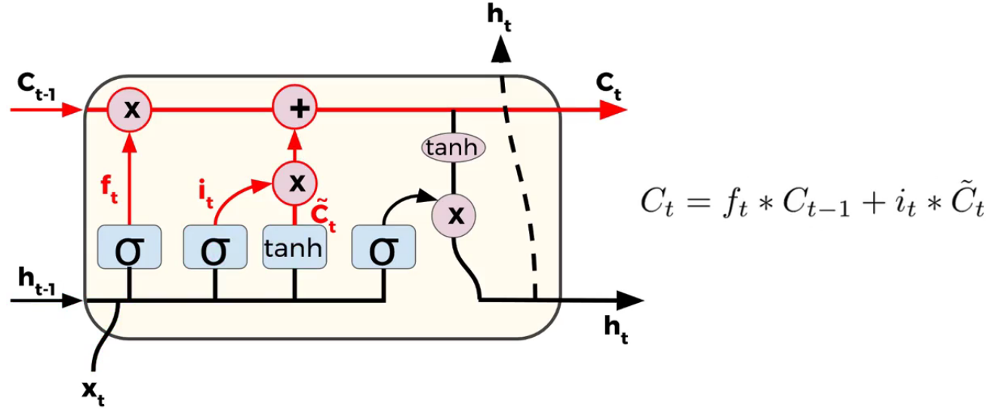
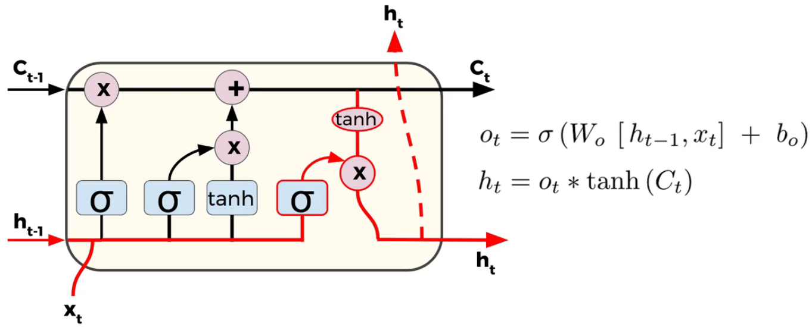

### [Home](index.html)

# Chatbot:

This was an open project where I could chose to do whatever I wanted that relates to Machine Learning. I decided to do a simple chatbot you can talk to.

## How I approached the project:

For this project, I decided to use Keras, a high level deep learning library in Python. I decided to use a recurrent neural network alongside LSTM cells for my chatbot. Here is my best explanation on how these work. Luckily for me, Keras gives you a simple-to-use API that allows you to integrate these highly-complicated concepts with relative ease.

### RNN Theory:

A recurrent neural network is a great way to solve problems involving sequences, such as time series data (sales), sentences, audio etc. You can imagine a sequence as a vector of information where the index location points out its point in time. Unlike a normal neuron in a feed forward network, a recurrent neuron sends the ouput back to itself.

As you can see, the neurons are recieving inputs from the previous timestep and the current timestep. You can do the same thing for multiple layers.

Since the output of these recurrent neurons at a certain timestep is technically a function from all the previous timesteps, you can then begin to think it has some sort of memory. Cells that are a function of inputs from previous time steps are also known as 'memory cells'.

### LSTM Theory:

LSTM stands for Long-Short Term Memory, and it is a way to keep the memory of initial inputs in a sequence so the network doesn't "forget" the first inputs, as information is lost at each step going through the RNN. We do this by modifying the 'memory cells' of a recurrent neural network. This is what an LSTM cell looks like.

Here we still have those original inputs from a normal RNN, but now we have a third input, called the 'cell state', represented as Ct-1. As outputs we have Ht, which is the original output, but now we also have a new cell state, Ct.

The very first step is called the forget gate layer. In this step we decide what information we're going to forget from the cell state. Because it's a sigmoid layer, it's always going to output something between 0 and 1, where 1 will represent to keep it and 0 will represent to get rid of it.

The next step is where we decide what information we want to store in the cell state. The first part is a sigmoid layer and the second part if a hyperbolic tangent layer. The sigmoid layer is called the input gate layer, and it returns values from 0 and 1. The second part is the hyperbolic tangent layer, which ends up creating a vector called 'new candidate values', which are candidate values that could be added to the state. In the next step, we combine these two to create an update to the cell state.

Here we update the old cell state by multiplying the old state by the vector outputted by the forget gate, which ends up forgetting the information we decided we want to forget. Then we add the input gate layer output times the candidate values. This scales the new candidate values by how much we decided to update each state value.

Our last step is what we output for Ht and Ct. This is going to be based off your cell state, just a filtered version. Using Ht-1 and Xt, we pass that into a sigmoid layer, which decides what parts of the cell state we're going to be outputting. Then we put the cell state through a hyperbolic tangent so it pushes the values to be between -1 and 1 and we're going to then multiply it by the outputs of the sigmoid gate, so that we only output the parts that we decided to.

### Implementation:

The way I implemented my code was by having three seperate python files that did their own task. These were 'preprocess_data.py', 'train_bot.py' and 'conversation.py'. The last one is the one you want to run to have an actual conversation with the bot.

### Preprocess Data:

Firt you want to run the 'preprocess_data.py' to process our raw data. We first take in a 'dialog_simple' file and outputs two seperate files, answers and context. Then we add padding to our questions and answers to make it fit our inputs of our model. If either or questions or answers exceed the size of the inputs, we cut out the data. Here we also add our 'BOS' (beginning of sentence) and 'EOS' (end of sentence) to signal to the bot when to end it's sentences when training.

### Traning:

Here is where we actually train our model, 'train_bot.py'. This is how our model looks like.

```python
ad = Adam(lr=0.00005)

input_context = Input(shape=(maxlen_input,),
                      dtype='int32', name='input_context')
input_answer = Input(shape=(maxlen_input,), dtype='int32', name='input_answer')
LSTM_encoder = LSTM(sentence_embedding_size, init='lecun_uniform')
LSTM_decoder = LSTM(sentence_embedding_size, init='lecun_uniform')
if os.path.isfile(weights_file):
    Shared_Embedding = Embedding(
        output_dim=word_embedding_size, input_dim=dictionary_size, input_length=maxlen_input)
else:
    Shared_Embedding = Embedding(output_dim=word_embedding_size, input_dim=dictionary_size, weights=[
                                 embedding_matrix], input_length=maxlen_input)
word_embedding_context = Shared_Embedding(input_context)
context_embedding = LSTM_encoder(word_embedding_context)

word_embedding_answer = Shared_Embedding(input_answer)
answer_embedding = LSTM_decoder(word_embedding_answer)

merge_layer = merge([context_embedding, answer_embedding],
                    mode='concat', concat_axis=1)
out = Dense(dictionary_size/2, activation="relu")(merge_layer)
out = Dense(dictionary_size, activation="softmax")(out)

model = Model(input=[input_context, input_answer], output=[out])

model.compile(loss='categorical_crossentropy', optimizer=ad)
```

It uses the [Adam optimizer](https://machinelearningmastery.com/adam-optimization-algorithm-for-deep-learning/) to reduce the error. We create our inputs for our context and answer and we embed them both using our word2vec system. We apply LSTM to both our context and answer, we merge both of them and lastly add two dense neural layers, one with a relu activation and one with a softmax activation. We then compile it using the optimizer I previoulsy measured and we measure loss using [categorical crossentropy](https://gombru.github.io/2018/05/23/cross_entropy_loss/). Our output is a vector of the size of our dictionary, where the index of the highest number is the word we choose when predicting the output.

Note: I did not come up with the architecture of this neural network, after spending countless hours testing out different architectures on the internet, I stumbled upon this one and decided it was the best one.

We train it by looping through our data created in the previous steps. We also save our weights.

### Conversation:

In the 'conversation.py' file, we once again create the our model and this time we predict the output by loading in our already trained weights. The decoder turns our tokenized input and turns it into a valid output using the predict function of our model. It does so by inputting our context alongside with a partial answer in a loop.

```python
ans_partial = np.zeros((1,maxlen_input))
    ans_partial[0, -1] = 2  #  the index of the symbol BOS (begin of sentence)
    for k in range(maxlen_input - 1):
        # INPUTTING RAW CONTEXT AND PARTIAL ANSWER INTO MODEL
        ye = model.predict([raw_context, ans_partial])
        # TAKING THE WORD WITH THE HIGHEST OUTPUT AND ADDING IT TO OUR PARTIAL ANSWER
        mp = np.argmax(ye)
        ans_partial[0, 0:-1] = ans_partial[0, 1:]
        ans_partial[0, -1] = mp
```

We first start out with ans_partial being filled with zeroe and the beginning of the sentence (BOS) as the last index of the array. As it iterates through the loop, we add the outputs of model.predict into the end of the array. We input into our model.predict our context and our partial answer, and it returns a vector of the size of our vocabulary and we add the index of the highest number in the vector. Once the bot feels like it's done with its sentence, it will output have the 3rd index as it's highest number in the vector, symbolizing it's the end of the sentence (EOS) (since 'EOS' is the 3rd index in our vocabulary). We then turn our answer of vectors into words using our vocabulary and we output it to the user.

## Reflection on the challenges I faced:

By far the biggest challenge of this project was finding the right model for my neural network. After looking in the internet countless of hours for good chatbot neural network models and reading many Medium articles on how LSTM and RNN work, I stumbled upon this one https://towardsdatascience.com/how-to-implement-seq2seq-lstm-model-in-keras-shortcutnlp-6f355f3e5639. I did my best to implement the model on my own with little help from the article other than it laying out the model for me.
